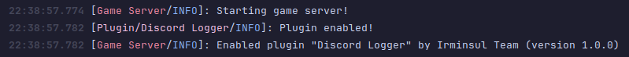
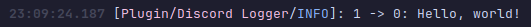
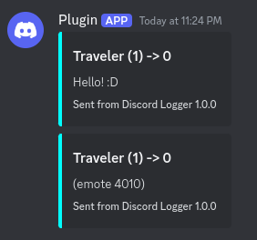

# Irminsul API

Irminsul provides a rich API with which you can develop plugins for both the game server and HTTP server.
This document will cover the basics of writing both types of plugins.

## Getting started (Game server plugin)

Let's write a simple game server plugin to log player joins/leaves and messages sent in-game to a Discord channel 
using a webhook.

Start by including the module containing the Irminsul API into your project.

```xml
    <dependency>
        <groupId>io.irminsul</groupId>
        <artifactId>common</artifactId>
        <version>1.0.0</version>
        <scope>provided</scope> 
    </dependency>
```

Create your main plugin class and extend the `GamePlugin` class located in `io.irminsul.common.plugin`. Implement the
required `onEnable` and `onDisable` methods. Your plugin **must** have a public constructor that takes in no parameters. 
Java creates this implicitly if you have no other constructor.

```java
package com.example.discordplugin;

import io.irminsul.common.game.GameServer;

public class DiscordPlugin extends GamePlugin {
    
    /**
     * Called by the plugin manager when this plugin is enabled by the server
     */
    @Override
    public void onEnable() {
        this.logger.info("Plugin enabled!");
    }

    /**
     * Called by the plugin manager when this plugin is disabled by the server
     */
    @Override
    public void onDisable() {
        this.logger.info("Plugin disabled!");
    }
}
```

As you may have noticed in the `onEnable` and `onDisable` methods in this example, you have access to an SLF4J logger
belonging to your plugin. You also have access to the `GameServer` to which your plugin is running on through the
`this.server` field.

` ⚠️ WARNING ` When a plugin is instantiated, and what state the server is in at that time, is unspecified and up to
the implementation. Our default game server makes no guarantees of safety or nullability at the time plugins are loaded.
Place your logic in `onEnable`, **not** your constructor!

Next, we must create a `plugin.properties` file to provide some basic information about our plugin.

```properties
# Required. The internal ID of your plugin
id=discord-logging-plugin

# Optional, but highly recommended. The version of your plugin
version=1.0.0

# Optional, but highly recommended. The display/friendly name of your plugin
name=Discord Logger

# Optional, but highly recommended. The author(s) of your plugin
author=Irminsul Team

# Optional. A website associated with your plugin, such as a Git repository
website=https://github.com/niqumu/Irminsul/

# Required. The main class of your plugin (whatever extends GamePlugin)
main=dev.niqumu.discordplugin.DiscordPlugin
```

` ⓘ Hint ` By convention, plugin IDs are all lowercase, with words separated by dashes.

` ⓘ Hint ` We strongly recommend follow semantic versioning for your plugin version numbers! (major.minor.patch)

Let's try it out! Build your plugin using Maven via the Package task.  Install the plugin using the steps shown further 
down in this document. Try running Irminsul and see what happens!



It works! It's not very interesting though. Let's make our plugin actually *do something*.

### Events

Most of your plugin logic will be based around subscribing to, and handling, events. The game server fires events for
basically everything. You can subscribe to events, add your own logic on them, manipulate them, or even cancel them 
altogether.

Irminsul's event bus is simple. Register an object as an event subscriber, and methods annotated with `@EventHandler`
will be called intelligently based on the event in the method parameters. Let's set up a basic handler for the
`PlayerLoginEvent` event.

```java
    @Override
    public void onEnable() {
        this.registerEventSubscriber(this);
    }

    @EventHandler
    public void onPlayerLogin(PlayerLoginEvent event) {
        this.logger.info("{} is logging in!", event.getPlayer().getProfile().getNickname());
    }
```

Let's try it out!


It works! We can get all sorts of information on the player joining through the event. Since `PlayerLoginEvent` does
not extend `CancellableEvent`, we aren't able to cancel the player login, since it's not really something we want to 
cancel.

Let's add a second event handler for the `PlayerChatEvent` event and see what we can do with it.

```java
    @EventHandler
    public void onPlayerChat(PlayerChatEvent event) {
        this.logger.info("{} -> {}: {}", event.getSender(), event.getRecipient(), event.getText());
    }
```



This picture shows a player messaging the server console (UID 0). It works! Now, let's use a simple Discord webhook
library to achieve our goal. If you aren't familiar with one, check out k3kdude's 
[simple one-class webhook wrapper](https://gist.github.com/k3kdude/fba6f6b37594eae3d6f9475330733bdb).

```java
    @EventHandler
    public void onPlayerChat(PlayerChatEvent event) {
        DiscordWebhook webhook = new DiscordWebhook(webhookUrl);
        DiscordWebhook.EmbedObject embed = new DiscordWebhook.EmbedObject();

        webhook.setUsername("Plugin");
        embed.setTitle("%s -> %d".formatted(event.getSender().toString(), event.getRecipient()));
        embed.setDescription(event.getEmote() != 0 ? ("(emote " + event.getEmote() + ")") : event.getText());
        embed.setColor(Color.CYAN);
        embed.setFooter("Sent from %s %s".formatted(this.getPluginInfo().getName(), this.getPluginInfo().getVersion()), "");

        try {
            webhook.addEmbed(embed);
            webhook.execute();
        } catch (IOException e) {
            this.logger.error("Couldn't send message to webhook!", e);
        }
    }
```

Let's try it out and send some messages to the server console!



It works! We did it! We wrote a simple plugin to log player chat messages to a Discord webhook.

## Installing a plugin

### Game server

Place your plugin .jar into the `plugins` folder within your server's run directory. This folder is created 
automatically when you first launch Irminsul. 

As Irminsul supports multiple game servers, simply dragging a plugin into the `plugins` folder isn't enough, as some 
people may want different plugins on different servers. You must go to your server's `config.hjson` and add the plugin 
name to the `plugins` array within the settings of the server you wish to add it to. The `.jar` is not needed.

```json
    # List of enabled plugins on this server
    "plugins": [
        "DiscordPlugin-1.0.0"
    ]
```

Attempting to use a plugin that server can't find will raise a warning, yet the server will continue without it. 
Likewise, having a plugin in your `plugins` folder that is not used by any servers will raise a warning.