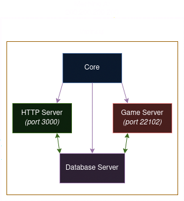
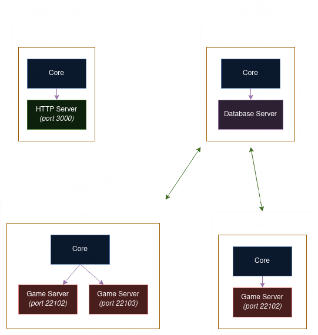

# Irminsul Infrastructure

Terminology:
- <b>Server:</b> A singular service running on a machine
- <b>Ecosystem:</b> A network of different types of servers, working together to provide a complete usable "server". 
MHY/HYV provide a default ecosystem that the client uses. Irminsul is a collection of services that run as 
<i>servers</i> to build a network, forming an <i>ecosystem</i> that users may play on.

<b>As you may have noticed, the Irminsul project consists of four modules: Common, Core, Game, and HTTP.</b>

Irminsul consists of two types of services: the HTTP server and the game server(s). The core module is responsible for 
igniting and managing these services. When configuring Irminsul, you can individually disable services in order to
build more complex setups with multiple machines.

Irminsul is very flexible. If you really know what you're doing and want to write your own infrastructure, you can 
bypass the simple core module and write your own code for launching and managing Irminsul's services.

Vanilla HK4E (the anime game) servers contain multiple game servers, each on their own dispatch region. As you likely
know, these regions are America, Europe, Asia, and SAR for the overseas release of HK4E.

### HTTP Server

In the official/vanilla architecture, a server authenticates the client, and then the client contacts a dispatch
server to provide a list of game servers the client can connect to (see the above list). Irminsul combines these servers
into a singular service known as the HTTP server. When players need to input an IP and port to connect to in a launcher
like Cultivation or Keqing Launcher, it's the HTTP server you give them the information of.

The job of the HTTP server is simple. Authenticate the user (email + password, or session), and give the client a list 
of game servers that the user may choose between. 

It is the job of the administrator to configure the HTTP server to point to valid game servers.

<b>You probably don't want multiple HTTP servers.</b> Irminsul doesn't support that. If you truly want to run multiple
server ecosystems with their own accounts (not game data, that's different), you must run multiple instances of 
Irminsul.

### Game Server

Game servers are monolithic, self-standing servers that host players in-game. Each region provided by the HTTP server
corresponds to a different game server. Game servers do not share player data amongst each other. Game servers are the 
vast majority of the logic of a server ecosystem like Irminsul.
- <i>Technically, the official ecosystem has another layer for load balancing, similar to Bungeecord/Velocity in 
Minecraft. Irminsul doesn't have a system like this at this time.</i> 

You can run multiple game servers within an ecosystem, either on one machine (under a single instance of Irminsul),
or multiple (under multiple Irminsul instances).

# Examples

<b>These examples include the DB server, which has not yet been implemented. Irminsul isn't production-ready yet.</b>

### A simple monolithic setup (default)

<i>A diagram showing the default setup of Irminsul. Purple arrows represent ignition, green arrows represent data.</i>

This diagram shows the default configuration of Irminsul: running as a monolithic service on a single machine with a 
singular game server. In this example, the HTTP server must be configured with `200:200:200:200:22102` as a game server, 
which is then passed along to the client on the login screen.

In this scenario, the end user would connect to `200:200:200:200:3000`, and would be given one server to join.

### A complex multi-machine network

<i>A diagram showing a complex setup of Irminsul. Purple arrows represent ignition, green arrows represent data.</i>

Here, we see a more complex setup of four Irminsul instances across four machines to build a single, large network of 
servers, forming an ecosystem. In this example, the HTTP server must be configured to point to the game servers at
`300:300:300:300:22102`, `300:300:300:300:22103`, and `400:400:400:400:22102`. Machines A, C, and D must be visible to 
the outside world on ports 3000, 22102 + 22103, and 22102 respectively. Machine B does not need to be visible to the 
outside world (and shouldn't be!).

Remember that the core implements next to no logic, and merely parses the ecosystem configuration and ignites services. 
You can replace it with custom code for complex arrangements like this and add your own features, such as profiling
and proper monitoring.

In this scenario, the end user would again connect to `200:200:200:200:3000`, and would be given three servers to join.
